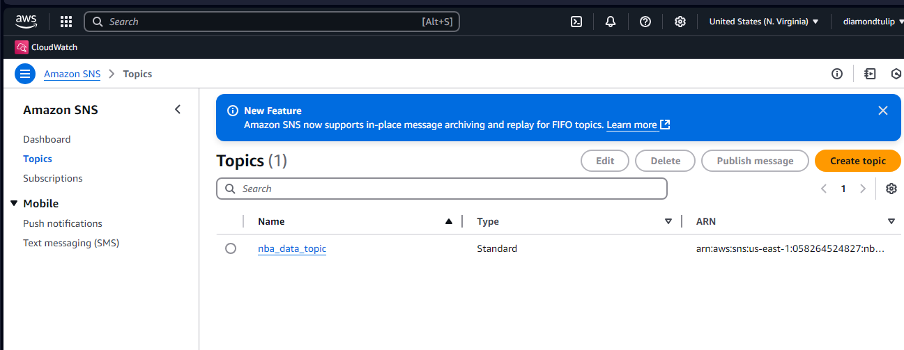
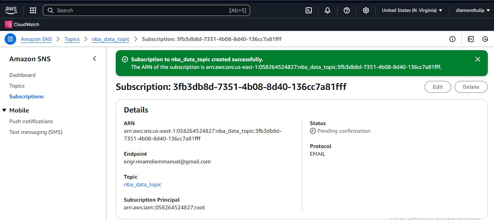
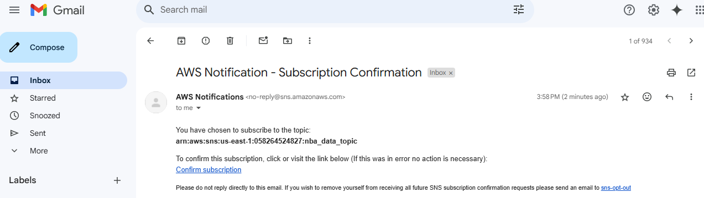
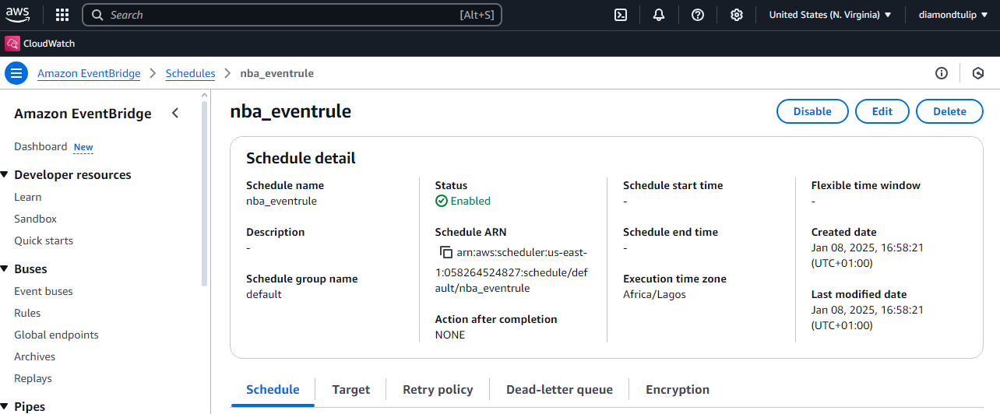
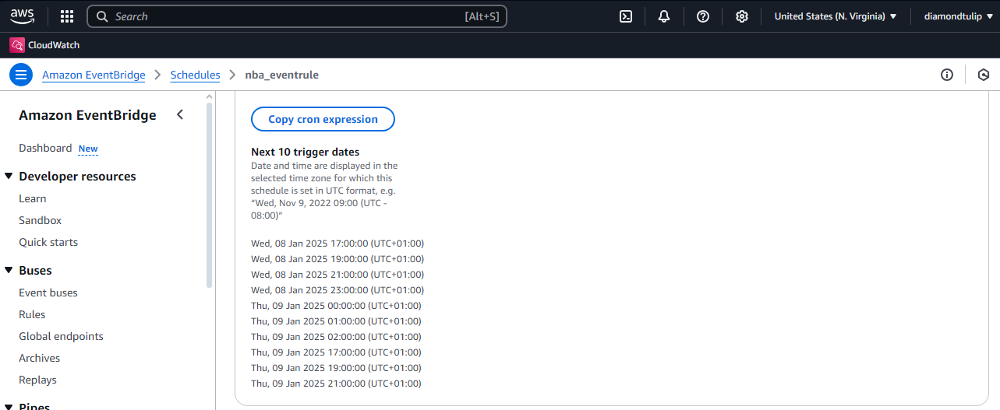
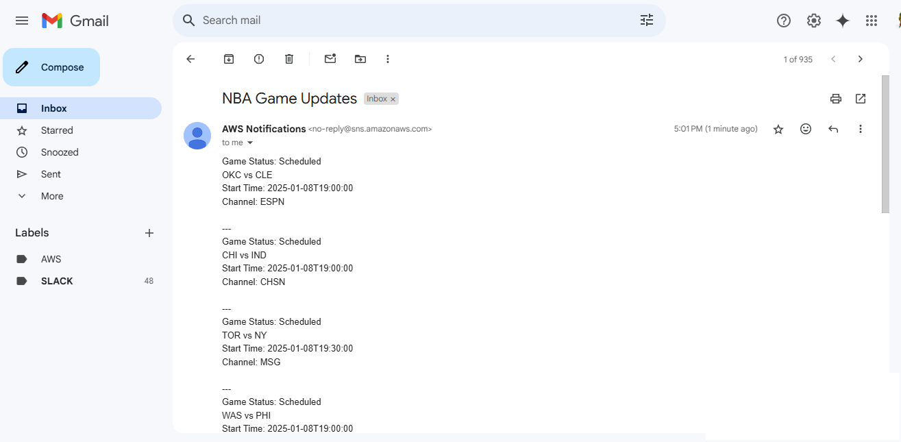

# DevOps AllStars Challenge

# Day 2: Building a Sports Game Day Notifications/ Alerts System


## **Project Overview**

This project is a real-time alert system that delivers NBA game day score notifications to subscribed users through SMS and email. It utilizes **Amazon SNS**, **AWS Lambda and Python**, **Amazon EvenBridge** and **NBA APIs** to keep basketball fans informed with the latest game updates. The project highlights cloud computing principles and efficient notification delivery mechanisms.
---

## **Project Architecture**
- Fetches live NBA game scores using an external API from  sportsdata.io.
- Sends formatted score updates to subscribers via SMS/Email using Amazon SNS.
- Scheduled automation for regular updates using Amazon EventBridge.
- The design adheres to AWS principle of least privilege for IAM roles.

---


---

## **Tools and Technologies**
- **Cloud Provider**: AWS
- **Core Services**: SNS, Lambda, EventBridge
- **External API**: NBA Game API (SportsData.io)
- **Programming Language**: Python 3.x
- **IAM Security**:
  - Least privilege policies for Lambda, SNS, and EventBridge.

---

## **Project Directory Structure**
```bash
nba_game_day_alerting_system/
├── src/
│   ├── nba_notifications.py          # Main Lambda function code
├── policies/
│   ├── nba_sns_policy.json           # SNS publishing permissions
│   ├── nba_eventbridge_policy.json   # EventBridge to Lambda permissions
│   └── nba_lambda_policy.json        # Lambda execution role permissions
├── .gitignore
└── README.md                        # Project documentation
```

## **Setup Instructions**


### **Create an SNS Topic on AWS console**

1. Open the AWS Management Console.
2. Navigate to the SNS service.
3. Click Create Topic and select Standard as the topic type.
4. Name the topic (e.g., nba_data_topic) and note the ARN.
5. Click Create Topic.




---

### **Add Subscriptions to the SNS Topic**

1. After creating the topic, click on the topic name from the list.
2. Navigate to the Subscriptions tab and click Create subscription.
3. Select a Protocol:
- For Email:
  - Choose Email.
  - Enter a valid email address.
- For SMS (phone number):
  - Choose SMS.
  - Enter a valid phone number in international format (e.g., +1234567890).

4. Click Create Subscription.
5. If you added an Email subscription:
- Check the inbox of the provided email address.
- Confirm the subscription by clicking the confirmation link in the email.
6. For SMS, the subscription will be immediately active after creation.




##


---


### **Create the SNS Publish Policy**

1. Open the IAM service in the AWS Management Console.
2. Navigate to Policies → Create Policy.
3. Click JSON and paste the JSON policy 
4. Replace REGION and ACCOUNT_ID with your AWS region and account ID.
5. Click Next: Tags (you can skip adding tags).
6. Click Next: Review.
7. Enter a name for the policy (e.g., nba_sns_policy).
8. Review and click Create Policy.

### **Create an IAM Role for Lambda**
1. Open the IAM service in the AWS Management Console.
2. Click Roles → Create Role.
3. Select AWS Service and choose Lambda.
4. Attach the following policies:
- SNS Publish Policy (nba_sns_policy) (created in the previous step).
- Lambda Basic Execution Role (AWSLambdaBasicExecutionRole) (an AWS managed policy).
5. Click Next: Tags (you can skip adding tags).
6. Click Next: Review.
7. Enter a name for the role (e.g., nba_role).
8. Review and click Create Role.


### **Deploy the Lambda Function**

1. Open the AWS Management Console and navigate to the Lambda service.
2. Click Create Function.
3. Select Author from Scratch.
4. Enter a function name (e.g., nba_notifications).
5. Choose Python 3.x as the runtime.
6. Assign the IAM role created earlier (nba_role) to the function.
7. Under the Function Code section:
- Copy the content of the src/nba_notifications.py file from the repository.
- Paste it into the inline code editor.
8. Under the Environment Variables section, add the following:
- NBA_API_KEY: your NBA API key.
- SNS_TOPIC_ARN: the ARN of the SNS topic created earlier.
9. Click Create Function.

---

### **Test the System**(Optional)
1. Open the Lambda function in the AWS Management Console.
2. Create a test event to simulate execution.
3. Run the function and check CloudWatch Logs for errors.
4. Verify that SNS notifications are sent to the subscribed users.


### **Set Up Automation with Eventbridge**
1. Navigate to the Eventbridge service in the AWS Management Console.
2. Go to Rules → Create Rule.
3. Enter a function name (e.g., nba_eventrule).
4. Select Event Source: Schedule.
5. Click Continue in Event Scheduler
6. Schedule pattern: recurring schedule
7. Select Cron based Schedule
8. Set the cron schedule for when you want updates (e.g., hourly).
9. Under Targets, select the Lambda function (nba_notifications) and save the rule.



---




---


### **First Notification from our service**




---
